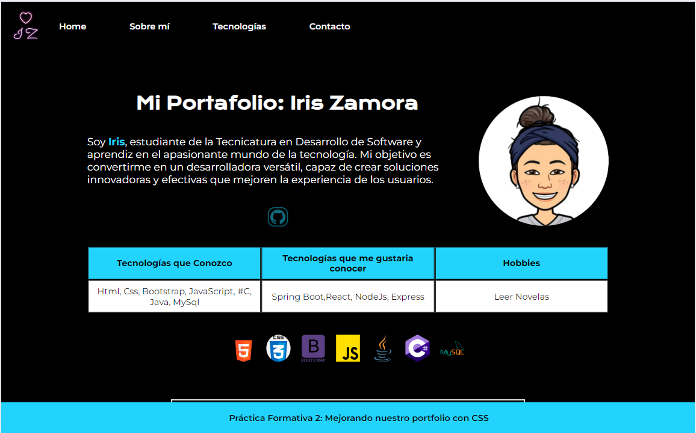

##Mi Portafolio - Iris Zamora
Este proyecto consiste en una página web de presentación personal, desarrollada en HTML y CSS. El principal objetivo de este portafolio es dar a conocer mis habilidades, intereses y ofrecer un canal de contacto accesible para quienes deseen comunicarse conmigo.

Descripción:
El portafolio incluye:

Una sección de presentación personal, donde comparto mis metas y el camino que estoy recorriendo en la Tecnicatura en Desarrollo de Software.
Un resumen de las tecnologías que manejo actualmente, aquellas en las que me gustaría seguir mejorando, y una pequeña mención de mis hobbies.
Un formulario de contacto sencillo para facilitar la comunicación directa.
Mejoras en esta versión:
En esta segunda entrega se han añadido diversas mejoras:

Un menú de navegación (nav) que permite desplazarse fácilmente entre las secciones de Sobre mí, Tecnologías y Contacto.
Se han incorporado íconos representativos de las tecnologías en las que me he capacitado y en las que continúo formándome.
El diseño ahora es responsivo, adaptándose a diferentes tamaños de pantalla, asegurando una visualización óptima en dispositivos móviles.

"